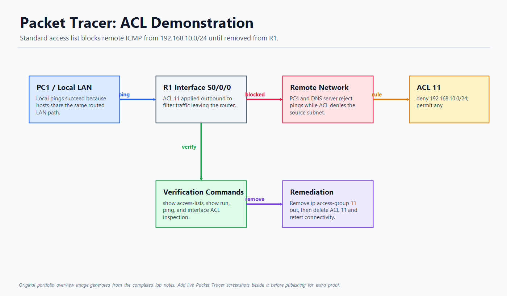

# Packet Tracer: ACL Demonstration

## Overview

This project demonstrates how a standard access control list can block traffic from a source network and how router verification commands can be used to troubleshoot the behavior.

The lab shows a simple but important network-security workflow: test connectivity, identify the ACL causing the failure, remove or adjust the ACL, and retest.

## Screenshot



## Skills Demonstrated

- Standard IPv4 access control lists
- Source-based traffic filtering
- Interface and direction troubleshooting
- Ping testing before and after a configuration change
- Router CLI verification
- Change validation after ACL removal

## Lab Workflow

1. Verified that local network pings were successful.
2. Tested pings from PC1 to remote devices.
3. Observed that remote pings failed because ACL 11 filtered traffic from the source subnet.
4. Used router show commands to inspect the ACL configuration.
5. Identified the interface and direction where the ACL was applied.
6. Removed the ACL from the interface.
7. Deleted ACL 11 from the router configuration.
8. Retested connectivity to confirm the remote pings succeeded.

## ACL Behavior Observed

The standard ACL blocked traffic from the `192.168.10.0/24` source network and then permitted other traffic. The ACL was applied outbound on the router serial interface, so matching traffic was filtered as it left the router toward remote networks.

Example verification commands:

```text
show access-lists
show run
show ip interface brief
ping
```

Example remediation commands:

```text
interface s0/0/0
no ip access-group 11 out
exit
no access-list 11
```

## Key Observations

- ACL placement matters as much as the ACL rule itself.
- Direction matters: inbound and outbound filtering affect different traffic paths.
- Local connectivity can work while remote connectivity fails because of router policy.
- Every network change should be followed by verification tests.

## Tools Used

- Cisco Packet Tracer
- Router CLI
- ICMP ping testing
- ACL and interface show commands

## Recommended Live Screenshots to Add

Add these images to the `screenshots/` folder before publishing for the strongest GitHub presentation:

- Packet Tracer topology overview
- Failed ping from PC1 to the remote host or DNS server
- `show access-lists` output showing ACL 11
- Router interface configuration showing ACL direction
- Successful ping after ACL removal

## Portfolio Summary

This project is a clean example of network access control and troubleshooting. It shows that you can identify a policy-based connectivity issue, verify it with CLI commands, safely remove the filter, and prove the fix.

