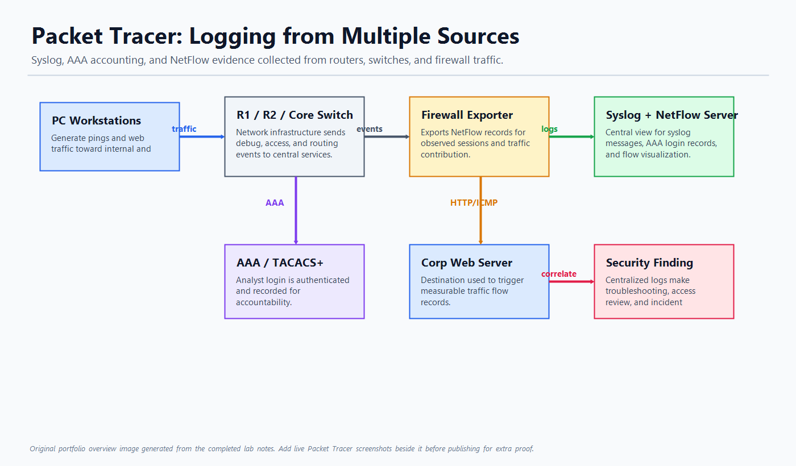

# Packet Tracer: Logging from Multiple Sources

## Overview

This project demonstrates how multiple network telemetry sources can be centralized for security monitoring. The lab uses Packet Tracer to observe Syslog messages, AAA/TACACS+ user accounting, and NetFlow records from network devices.

The project is useful for showing blue-team fundamentals: collecting logs, tracking authenticated access, reviewing network flow records, and thinking about how those signals would feed into a SIEM.

## Screenshot

## Skills Demonstrated

- Syslog collection from routers, switches, and firewall devices
- AAA and TACACS+ user access logging
- NetFlow traffic visibility
- Basic event correlation across multiple security data sources
- Packet Tracer network troubleshooting
- SOC-style thinking around centralized monitoring

## Lab Workflow

1. Opened the Syslog service on the central server.
2. Generated router debug messages so network devices would send logs to the Syslog server.
3. Logged into a router with AAA/TACACS+ credentials to create an accounting record.
4. Logged out and verified that a second accounting event was recorded.
5. Generated traffic to the corporate web server.
6. Reviewed NetFlow records to identify source, destination, protocol, packet count, and traffic contribution.

## Key Observations

- Syslog entries provide useful context such as device name, timestamp, and event message.
- AAA accounting creates an audit trail for user login and logout activity.
- NetFlow gives traffic-level visibility that complements log messages.
- Centralizing these sources makes investigation easier than checking each device separately.

## Tools Used

- Cisco Packet Tracer
- Syslog service
- AAA/TACACS+ accounting
- NetFlow Collector
- Router and firewall CLI

## Portfolio Summary

This project shows the foundation of network security monitoring. It connects device logs, user access records, and flow telemetry into one investigation story, which is directly relevant to SOC analyst, network security, and cyber operations roles.

