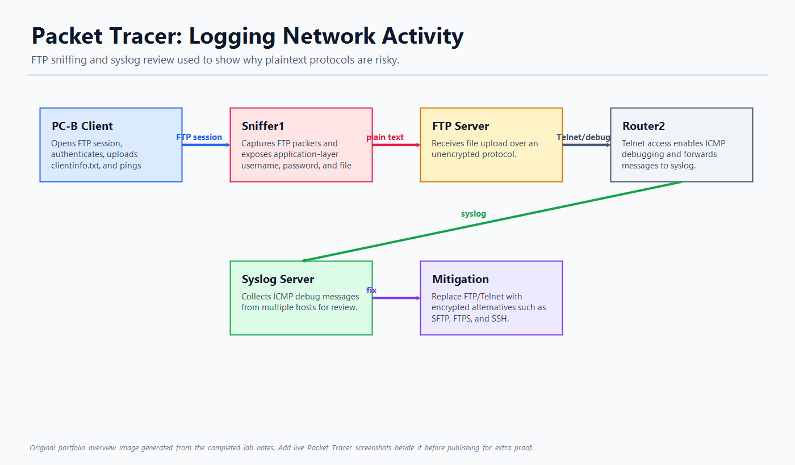

# Packet Tracer: Logging Network Activity

## Overview

This project demonstrates how insecure network services can expose sensitive information and how logging helps investigate network activity. The lab focuses on FTP traffic inspection, syslog messages, and ICMP debugging in Packet Tracer.

The main security lesson is that plaintext protocols such as FTP can reveal credentials and transferred data to anyone who can inspect the traffic path.

## Screenshot

## Skills Demonstrated

- Packet sniffing and application-layer traffic inspection
- Identifying plaintext FTP credentials and file-transfer data
- Router debug logging
- Syslog message review
- ICMP traffic testing
- Secure protocol recommendation and mitigation planning

## Lab Workflow

1. Enabled the sniffer device and monitored traffic entering the capture point.
2. Opened an FTP session from a client host to the FTP server.
3. Uploaded a test file to the FTP server.
4. Reviewed captured FTP packets and inspected application-layer details.
5. Connected to Router2 and enabled ICMP debugging.
6. Generated ping traffic from multiple PCs.
7. Reviewed the Syslog server to compare ICMP-related log entries.

## Key Observations

- FTP sends usernames, passwords, commands, and transferred data without encryption.
- Packet captures can expose sensitive information when insecure protocols are used.
- Syslog provides a central place to review router-generated events.
- ICMP debug output can help identify traffic sources during troubleshooting.

## Security Mitigation

FTP and Telnet should be replaced with encrypted alternatives:

- Use SFTP or FTPS instead of FTP.
- Use SSH instead of Telnet.
- Limit debug logging in production because it can be noisy and may affect performance.
- Send device logs to a centralized logging or SIEM platform.

## Tools Used

- Cisco Packet Tracer
- Packet Tracer Sniffer
- FTP client and server
- Router CLI
- Syslog service

## Portfolio Summary

This project is a practical security demonstration: it shows how an attacker or analyst can observe plaintext network traffic, then uses logs to validate activity. It is a strong GitHub project because it connects traffic analysis, logging, and mitigation.

