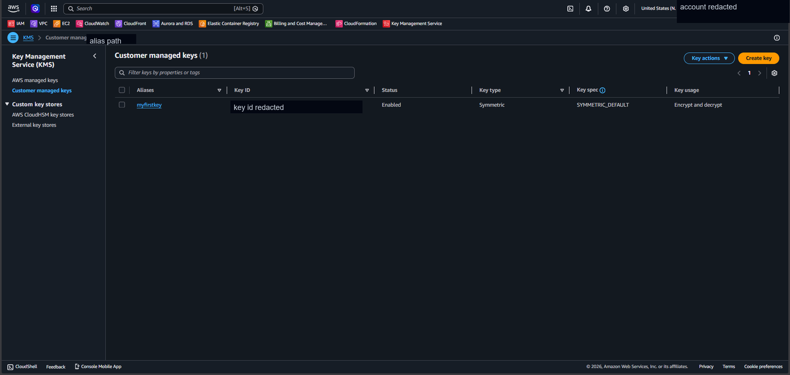
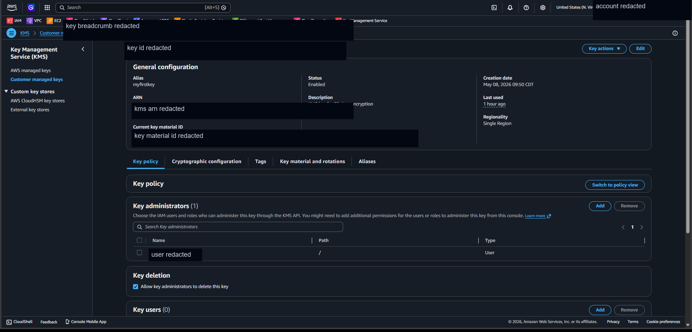
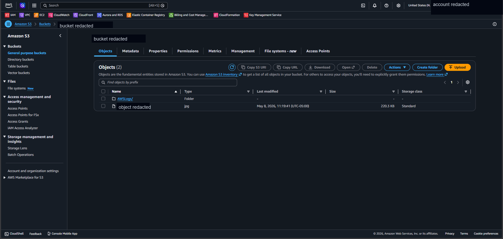
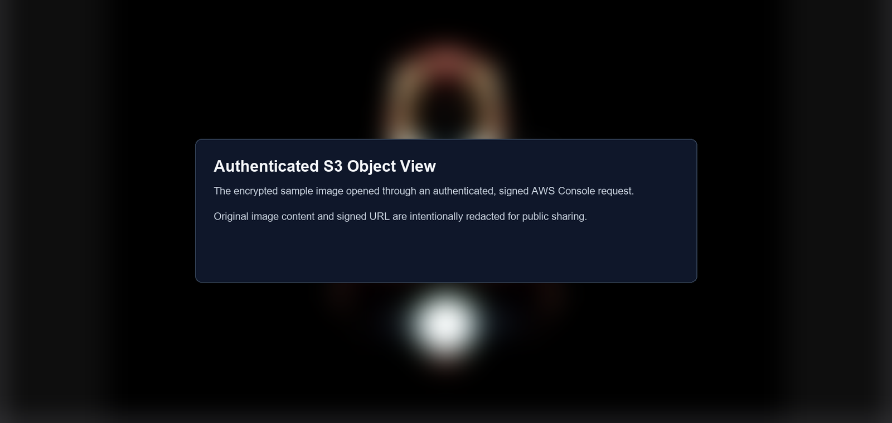
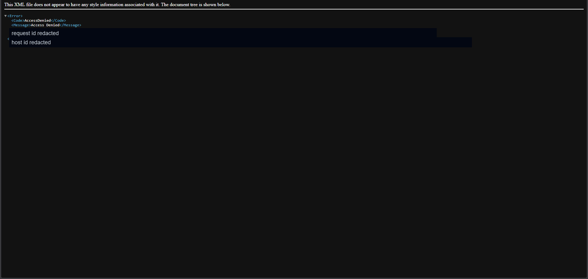
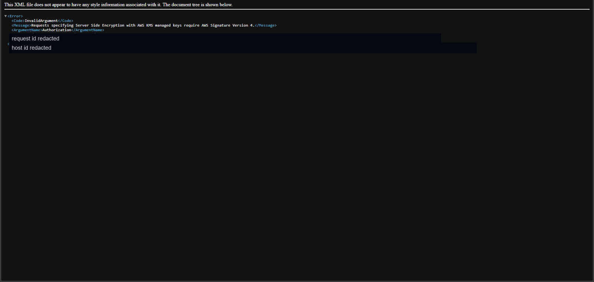
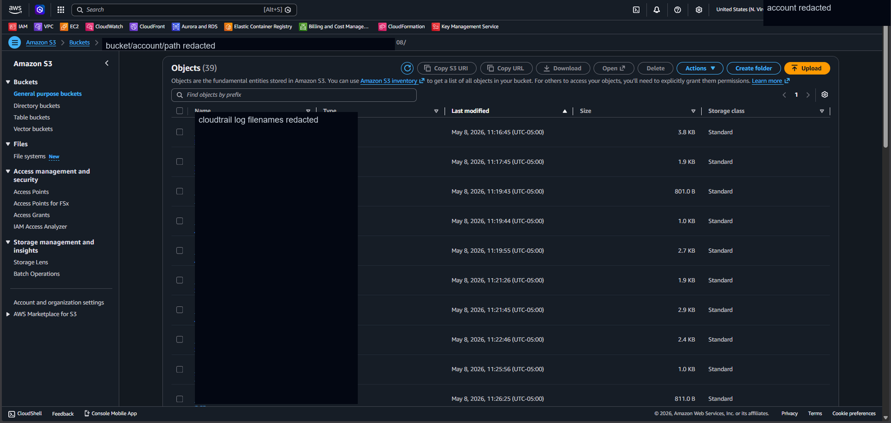
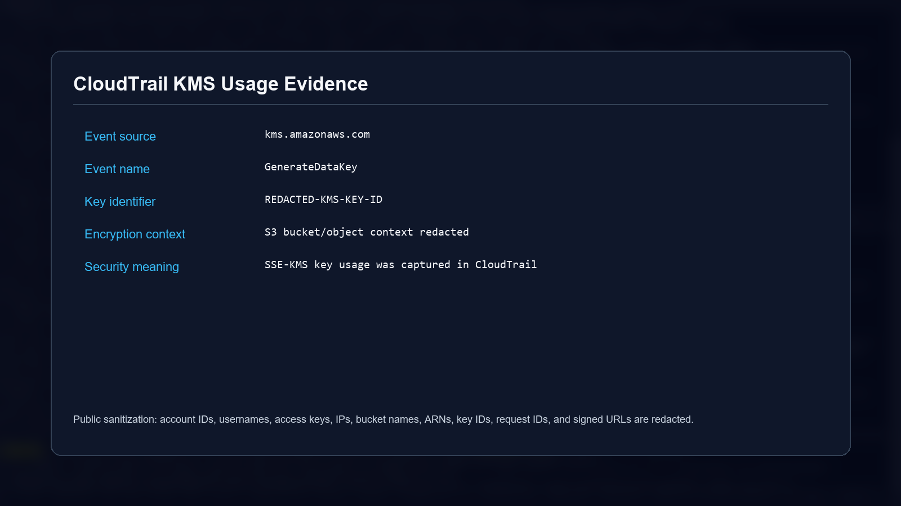
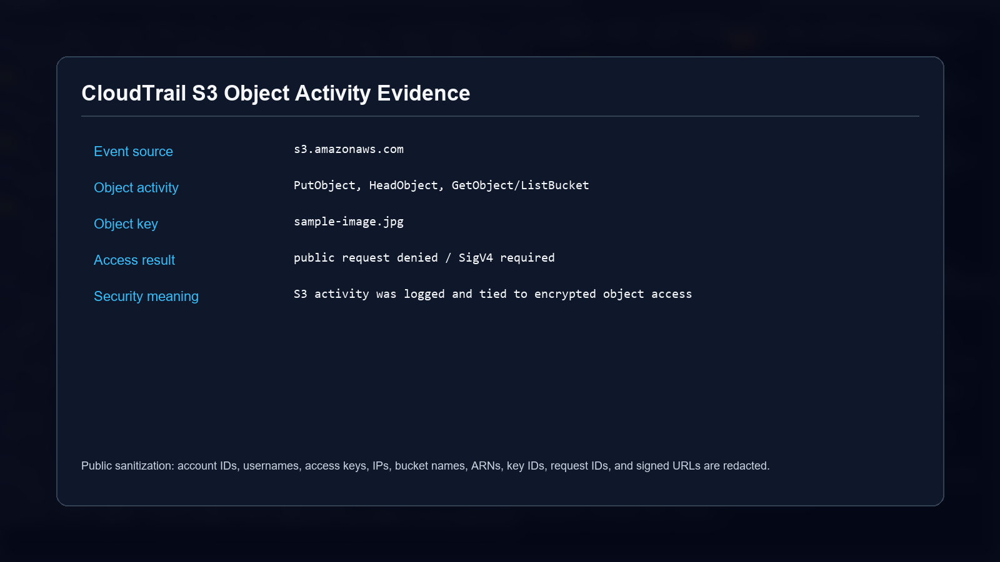

# AWS KMS CloudTrail S3 Encryption Lab

Hands-on AWS cloud security lab demonstrating how **Amazon S3**, **AWS Key Management Service (KMS)**, and **AWS CloudTrail** work together to protect stored data and produce audit evidence.

The lab focused on encrypting an S3 object with a customer-managed KMS key, testing access behavior, and validating key usage through CloudTrail logs.

---

## Project Overview

In this lab, I configured:

- A customer-managed symmetric KMS key for S3 encryption
- A CloudTrail trail that stores audit logs in S3
- An S3 object encrypted with server-side encryption using KMS (SSE-KMS)
- Public access testing against a KMS-encrypted object
- CloudTrail log review for S3 object activity and KMS key usage
- KMS key permission changes to validate access control behavior

```text
User upload -> Amazon S3 object -> SSE-KMS encryption -> Customer-managed KMS key
                                      |
                                      v
                              CloudTrail audit logs
                                      |
                                      v
                                S3 log storage
```

---

## AWS Services Used

- AWS Key Management Service (KMS)
- Amazon S3
- AWS CloudTrail
- AWS IAM

---

## Evidence Walkthrough

### 1) Customer-Managed KMS Key

Created a symmetric customer-managed KMS key for encrypting S3 data.



### 2) KMS Key Policy and Permissions

Reviewed key administration and key-user permissions to understand who can manage or use the encryption key.



### 3) S3 Bucket Object List

Uploaded a sample image object to the S3 bucket and applied SSE-KMS encryption.



### 4) Authenticated Object Access

Verified that the encrypted object could be opened through an authenticated AWS Console request.



### 5) Public URL Access Denied

Tested direct public access before public permissions were adjusted. The request was denied.



### 6) SSE-KMS Requires Signed Requests

After public object access was attempted, the encrypted object still required AWS Signature Version 4. This showed that public S3 object permissions do not bypass KMS protections.



### 7) CloudTrail Log Files

Confirmed CloudTrail generated S3 log files after the object upload and access attempts.



### 8) KMS Key Usage Evidence

Found CloudTrail evidence showing KMS activity associated with the encrypted S3 object workflow.



### 9) S3 Object Activity Evidence

Validated S3 object-level activity in CloudTrail, including upload and access-related events.



---

## Security Takeaways

- SSE-KMS adds key-level access control on top of S3 object permissions.
- A public S3 object encrypted with KMS still requires properly signed AWS requests and KMS authorization.
- CloudTrail provides audit evidence for S3 object activity and KMS key usage.
- Customer-managed KMS keys support granular control over key administrators and key users.
- Removing KMS key-user permissions can immediately revoke the ability to use that key for encrypt/decrypt operations.

---

## Public Sanitization Notes

The evidence in this repository has been sanitized for public sharing. The following items were redacted:

- AWS account IDs
- IAM usernames and account display names
- KMS key IDs, ARNs, and key material identifiers
- S3 bucket names and object identifiers
- Access key IDs and session identifiers
- Source IP addresses
- Request IDs and host IDs
- Signed URLs and browser URL-bar contents
- Raw CloudTrail JSON log contents

The original course PDF and raw screenshots were not added to this repository.

---

## Resume Impact

- Completed an AWS encryption and audit lab using S3, KMS, CloudTrail, and IAM to validate encrypted object storage, signed-request enforcement, and key-usage logging.
- Documented sanitized evidence showing SSE-KMS access behavior, CloudTrail log generation, and customer-managed key permission review.
